# A comprehensive benchmark study of protein structure alignment tools on downstream tasks
This study benchmarks nine protein structure alignment algorithms on three downstream tasks. Running time and memory consumption are tested as well. 

The preprint version can be found on bioarxiv: [https://www.biorxiv.org/content/10.1101/2025.03.11.642719v1](https://www.biorxiv.org/content/10.1101/2025.03.11.642719v1)

* We find large discrepancies between the alignment performance (e.g., TM-score, RMSD) and task accuracy performance of existing structure alignment tools.
* We demonstrate that structure information is useful for tasks including phylogeny reconstruction and function inference that are previously tackled by sequence-based alignment methods.
* Moreover, we show that structure information improves overall performance of existing tools in phylogeny reconstruction and function inference when combined with sequence information.
* Our evaluation on running time and memory consumption of these tools suggests that the trade-off between task accuracy and speed is still the major consideration in developing new alignment tools when applied in downstream tasks.

For more details please see our manuscript on bioRxiv.

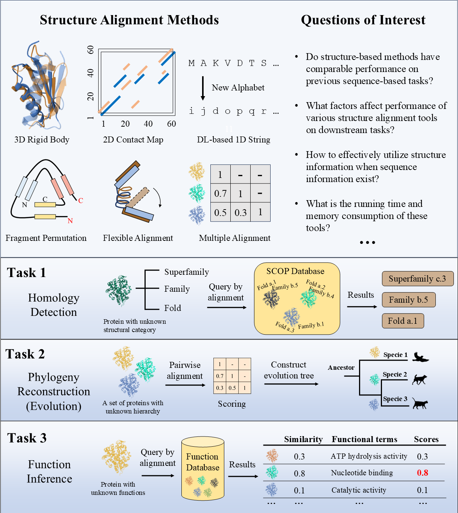

## Acknowledgment
We thank the excellent work done by DALI, Foldtree, and TEMPROT, and also other teams that have been working on protein structure datasets such as SwissTree, UniProt, and CAFA. Many codes of our work are based on existing public codes, and we adopt them for our investigation.
## Results
<p float="left">
  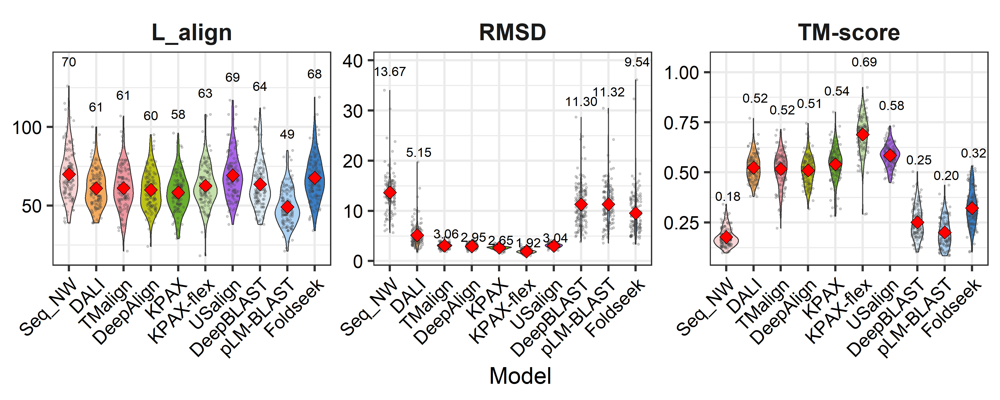
  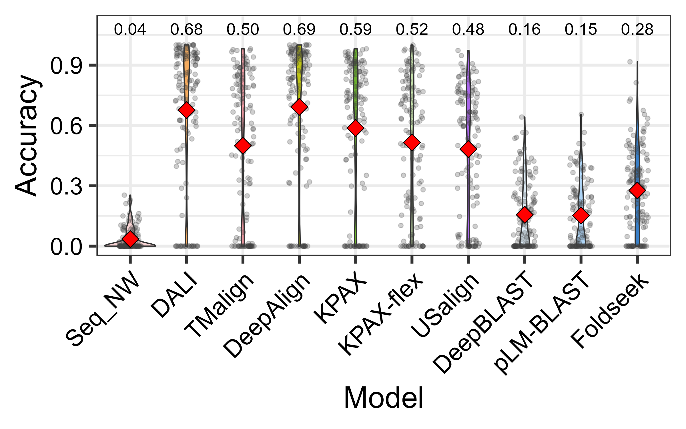
</p>

<p float="left">
  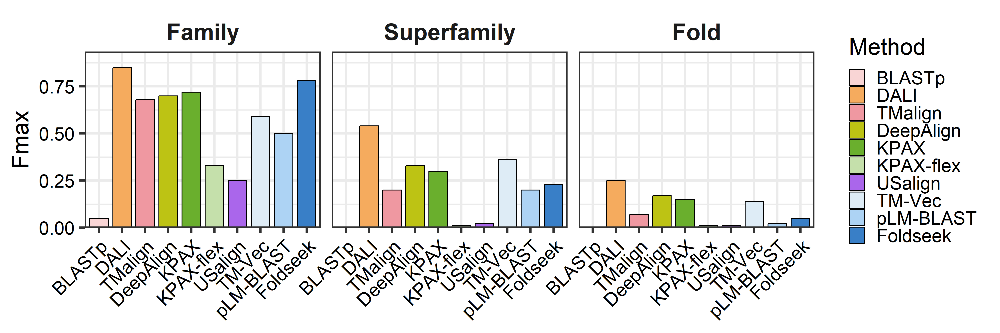
  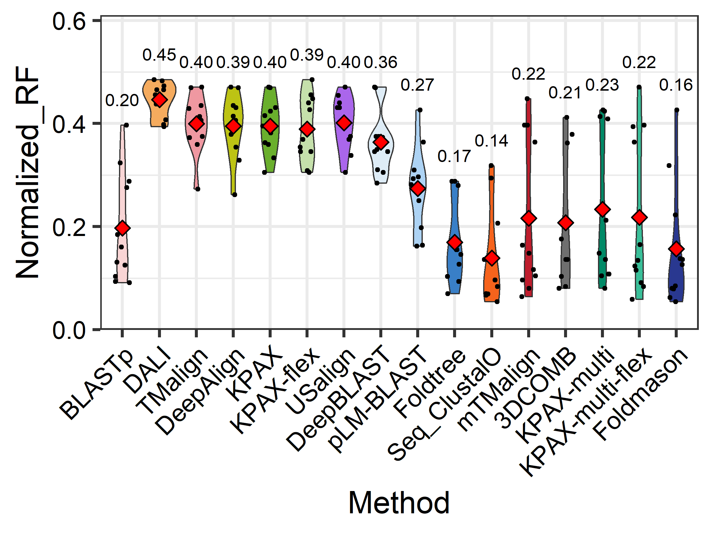
  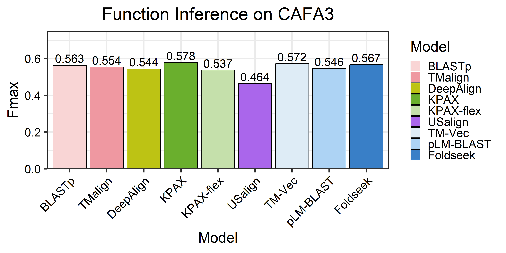
</p>

**Figure 1.** Results for all tasks. **Fisrt row**: Reference-independent alignment metrics and reference-dependent accuracy on Malisam. **Second row**: Performance on homology detection, phylogeny reconstruction, and function inference.

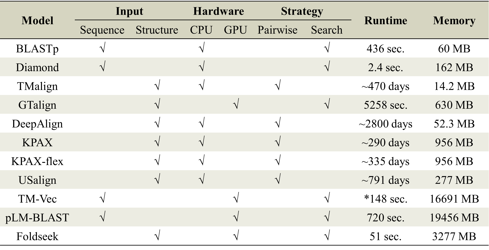

**Figure 2.** Running time and memory consumption comparison of different alignment tools. * indicates that TM-Vec is not able to process >1000 aa and we use truncated sequences as inputs instead.
.

## Environment
Detailed information please refer to our manuscript and the online supplementary.

```
* python=3.7.12
* numpy=1.21.6
* biopython=1.81
* pandas = 1.3.5
```

## Database download
Before running any codes, please download all databases for benchmarking following the instruction in the `database` folder. Data is stored in [Zenodo](https://zenodo.org/records/14938229).

**Alignment performance**
* Malisam: **130** difficult non-homologous proteins in different families from SCOP (Accuracy, TM-score)
* Malidup: **241** difficult proteins with internal duplicated structures (Accuracy, TM-score)

**Homlogy detection**
* SCOP140: **140** proteins from the SCOP database and search against **15211** SCOPe 2.07 database for classification (Fmax)

**Phylogeny reconstruction**
* SwissTree: **ST001-ST011** trees, each with proteins ranging from **25** to **131** (RF distance, TCS score)

**Function inference**
* CAFA3-MF: **1137** proteins for molecular function prediction against **32421** proteins using homology search (Fmax, Smin, AUPR)

## Software and tools download
Download tools or methods you need to reproduce the results in our study. More information can be found in our manuscript. If you choose one or more of BLASTp, TMalign, DeepAlign, KPAX, and USalign, make sure their executable files are in the enviroment path and can be called directly. For the three deep-learning methods, you may setup separated conda environment for each of them, and ensure **they are installed in this project folder**.
* [BLASTp](https://ftp.ncbi.nlm.nih.gov/blast/executables/blast+/LATEST/)
* [DALI](http://ekhidna2.biocenter.helsinki.fi/dali/README.v5.html)
* [TM-align](https://zhanggroup.org/TM-align/TMalign.cpp)
* [DeepAlign](https://github.com/realbigws/DeepAlign/)
* [KPAX/KPAX-flex](https://kpax.loria.fr)
* [US-align](https://github.com/pylelab/USalign)
* [DeepBLAST](https://github.com/flatironinstitute/deepblast)
* [pLM-BLAST](https://github.com/labstructbioinf/pLM-BLAST)
* [Foldseek](https://github.com/steineggerlab/foldseek)

Other methods tested in the manuscript include: BLASTp, Diamond, GTalign, Clustal Omega, mTMalign, 3DCOMB, FoldTree, and Foldmason.

## 1. Alignment quality evaluation (accuracy, TM-score)
For each tool, find the corresponding `*_Malidup.py` or `*_Malisam.py` script to generate results. Then use `concatResult.py` to generate a final csv file for accuracy or reference-independent metrics such as TM-scores and RMSD. The integrated results can be generated with the following pipeline. Make sure you are in the folder that containing the Malidup or Malisam data folder. Use **DeepAlign** as the example:
```bash
python script/deepalign_Malidup.py
```

For processing eixisting results of **TM-align** and **DALI**:
```bash
python script/processMalidup.py
```

For the three deep-learning methods, copy the corresponding `<algm>_<dataset>.py` script to their own folders and run from their own folders.

**pLM-BLAST**. Make sure you have installed the pLM-BLAST project from github in the project folder and have downloaded MalidupPDB.tar.gz, MalisamPDB.tar.gz, Malidup_plmblast_pt.tar.gz, and Malisam_plmblast_pt.tar.gz, and decompressed them as folders in the project folder.
```bash
python createFastaFold.py MalidupPDB MalidupFasta
python createFastaFold.py MalisamPDB MalisamFasta
cp plmblast_Malisam.py plmblast_Maliudp.py pLM-BLAST
cd pLM-BLAST
python plmblast_Malidup.py
```

**DeepBLAST**. Make sure you have installed the deepblast project from github in the project folder.
```bash
cp script/deepblast_Malisam.py script/deepblast_Maliudp.py deepblast
cd deepblast
python deepblast_Malidup.py
```

**Foldseek**. Make sure you have installed the foldseek project from github and it can be called directly.
```bash
sh foldseek_Mali_pipeline.sh
python script/foldseek_Malidup.py
```

After performing pairwise alignments with all tools in interest:
```bash
python concatResult.py Malidup Malidup.accuracy accuracy
python concatResult.py Malidup Malidup.tmscore tmscore
```

Result files for Malidup are `Malidup.accuracy` and `Maldup.tmscore` for reference-dependent accuracy and reference-independent metrics, respectively.

If you want to know how we calculate the accuracy and extract the metrics from TMalign result, see the next two subsessions.

---
### Accuracy evaluation
First retrieve the alignment pattern from the alignment result from any alignment tools, and then arrange it as the following:
```
ppakRPEQGLLRLRKGLD--lYANLRPAQIF--DVDILVVREltGNMFGDILSDEASQLTgs----igMLPSASLGe-----------graMYEPIHGS
-ftyEEVLAFEERLEREAeapSLYTVEHKVDfpVEHCYEKAL--GAEGVEEVYRRGLAQRhalpfeadGVVLKLDDltlwgelgytaraprFALAYKFP
```

We name the above format without sequence descriptions as **.ali** format. Then run the following code to calculate the accuracy given a ground truth alignment:
```bash
python accuracy.py <groundtruth.ali> <predict.ali>
```

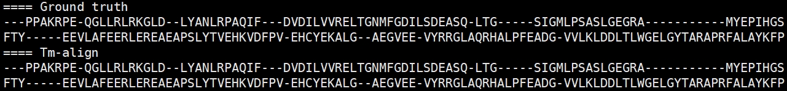

The outputs contain precision, recall, and accuracy score. Lowercase letters in the `<predict.ali>` file stand for unaligned or low-confident positions. Noted that letters in the `<groundtruth.ali>` file are all uppercase, and `<predict.ali>` file with only uppercase letters results in identical accuracy, recall and precision scores.

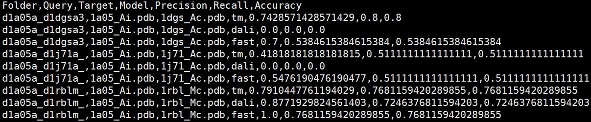

---
### TM-score evaluation
We provide the downloaded **TMalign** source file here and please follow the script below to compile it. Add the path where TM-align is in to the environment so that it can be called directly. Detailed intructions of TM-align are on [Zhang's lab](https://zhanggroup.org/TM-align/) website.

You can add the path of TM-align directly to your .bashrc configure file.
```bash
g++ -static -O3 -ffast-math -lm -o TMalign TMalign.cpp
export PATH=$PATH:$(pwd)
```

Before running TMalign we need to convert the provided `*.ali` file into `fasta` format which looks like the follows. The codes for conversion is included in our pipeline.
```
>aln1
ppakRPEQGLLRLRKGLD--lYANLRPAQIF--DVDILVVREltGNMFGDILSDEASQLTgs----igMLPSASLGe-----------graMYEPIHGS
>aln2
-ftyEEVLAFEERLEREAeapSLYTVEHKVDfpVEHCYEKAL--GAEGVEEVYRRGLAQRhalpfeadGVVLKLDDltlwgelgytaraprFALAYKFP
```

Use the following code to calculate the tm-score given two pdb files and an alignment file in fasta format:
```
TMalign <query.pdb> <target.pdb> -I <result.ali.fasta>
```

Our pipeline extracts the TM-score and RSMD from the TMalign result file, and calculate the Lalign using the provided `*ali` file by counting the uppercase letters instead.

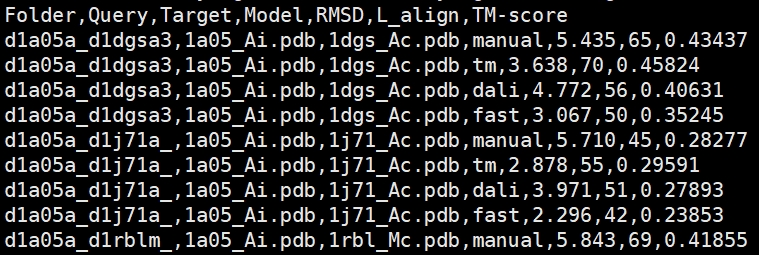

## 2. Homology detection accuracy evaluation (Fmax)
We adopt the classification pipeline used in DaliLite to classify 140 proteins from SCOP against 15211 pdbs from SCOPe 2.07. This task is a binary classification for all protein pairs between query set and target set. Each pair has a label denoting whether they are in the same family, superfamily, or fold. After downloading the data from the DALI website, decompress it and rename it as `SCOP140`.

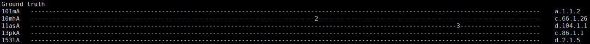

To perform the evaluation, first generate pairwise alignment or database search results for the tool of interest using `classification_*.py` and make sure the outfile file is in the `SCOP140/ordered_pooled`, then use `evaluate_ordered_lists.pl` in the `SCOP140/bin` folder as described in the `README.benchmark` file. Results for TM-align, DALI, and DeepAlign are provided in the downloaded SCOP140 dataset from the DALI server website. 

We implement batch processing for large-scale pairwise comparison for **KPAX** and **US-align** with a batch of 64:
```bash
cp script/classification_kpax.py script/classification_usalign.py genComp_classification.py classificationPipeline.sh SCOP140
cd SCOP140
python genComp_classification.py
sh classificationPipeline.sh kpax 64
cp ../script/merge_classification_kpax.sh ../script/process_classification_kpax.py kpax_results
cd kpax_result
sh merge_classification_kpax.sh
python process_classification_kpax.py
```

For the three deep learning methods:

**pLM-BLAST**:
```bash
cp scipt/classification_plmblast.sh pLM-BLAST
cd pLM-BLAST
sh classification_plmblast.sh
```

**TM-Vec**:
```bash
sh script/SCOP140_foldseek.sh
```

**Foldseek**：
```bash
sh foldseek_pipeline_classification.sh
```

After performing alignments with all tools in interest, we have all results in the ordered_pooled folder:
```bash
cd SCOP140
bin/evaluate_ordered_lists.pl ordered_pooled/ combinetable.pdb70 scope_140_targets.list pooled > evaluation_results/pooled_pdb70
```

Results for Fmax score are written in file `SCOP140/evaluation_results/pooled_pdb70`.

## 3. Phylogeny reconstruction quality evaluation (RF distance, TCS score)
We adopt the workflow used in Foldtree to investigate the performance of different tools on predicting evolutionary hierarchies. RF distance is used to quantify the topological difference between the predicted tree and the ground-truth species tree. We have already included most of the output trees and results in the **SwissTree.tar.gz** and **SwissTree_cluster.tar.gz** file on Zenodo. Please download it first, place and decompress it in the project folder.

```bash
conda install -c bioconda fastme
pip install ete3 toytree colour wget statsmodels matlplotlib seaborn
```

To run the pipeline and reproduce the result, first generate pairwise alignment or database search results for the tool of interest using `swisstreeIterate_*.py`, then change the working path to the `foldtree` directory and run `TreeConstruct.py` with corresponding arguments `<method>` and `metric`.

**Before running foldtree, you may activate the foldtree-specific conda environment first.  Make sure you have downloaded the SwissTree data and rename it as "SwissTree".**

To run the **FoldTree** pipeline, use the commands below. **This step is recommended** for generating necessary input files.
```bash
cp script/SwissTree2identifier.py script/TreeConstruct.py script/TreePipeline.py fold_tree
sh script/SwissTree2fasta.sh
cd fold_tree
python SwissTree2identifier.py
python TreePipeline.py
```

Use **TM-align** and **KPAX** as the example, first performance pairwise alignment of all proteins in all families. **DeepAlign** and **USalign** can be evaluated using scripts with the suffix `deepalign` and `USalign`, respectively.
```bash
for i in ST001 ST002 ST003 ST004 ST005 ST006 ST007 ST008 ST009 ST010 ST011; do
    python script/siwsstreeIterate_tmalign.py ${i}
    python script/siwsstreeIterate_kpax.py ${i}
done

cd fold_tree
python TreeConstruct.py TMalign TMscore
python TreeConstruct.py KPAX Identity
```

To analyze **DALI** results, upload all pdb files of a family to the server with the **All against all** function. Download the `newick_unrooted.txt` tree file from the server and place the downloaded tree file in the corresponding SwissTree family subfolder (e.g.,ST001). Rename it as `dali_unrooted.nhx`.
```bash
for i in ST001 ST002 ST003 ST004 ST005 ST006 ST007 ST008 ST009 ST010 ST011; do
    python script/renameDaliTree.py ${i}
done

cp script/TreeConstruct_dali.py fold_tree
cd fold_tree
python TreeConstruct_dali.py
```

**pLM-BLAST.** Make sure you have installed pLM-BLAST from github.
```bash
cp script/swisstreeIterate_plmblast.py pLM-BLAST
cd pLM-BLAST

for i in ST001 ST002 ST003 ST004 ST005 ST006 ST007 ST008 ST009 ST010 ST011; do
    python swisstreeIterate_plmblast.py ${i}
done

cd ../fold_tree
python TreeConstruct.py plmblast TMscore
```

**DeepBLAST.** Make sure you have installed deepblast from github, downloaded models `deepblast-v3.ckpt` and `prot_t5_xl_uniref50` and place them in the `models` folder in the project folder.
```bash
cp script/swisstreeIterate_deepblast.py deepblast
cd deepblast
python swisstreeIterate_deepblast.py
cd ../fold_tree
python TreeConstruct.py deepblast TMscore
```

For multiple-sequence/structure alignment, please install **FastTree** first and the programme can be called directly. You have to install the corresponding tool (e.g., **Clustal Omega**, **mTMalign**, **3DCOM**) first referring to our online supplementary.

Use **KPAX-MSA** as the example:
```bash
cp TreeConstruct_kpaxmulti.py fold_tree
cd fold_tree
python TreeConstruct_kpaxmulti.py
```

Results for TCS score and RF distance are stored in files `SwissTree.congruence` and `SwissTree.rf`, respectively.

## 4. Function inference
A multi-label multi-class classification task. The GO terms of the target protein are transfered to the query protein, using the structural similarity value as the coefficient for all terms.

First generate pairwise alignment or database search results for the tool of interest using `function_*.py`, then change the working path to the `CAFA3_MF` directory and run `evaluate.py` with corresponding arguments.

We implement batch processing for large-scale pairwise comparison for **TM-align**, **DeepAlign**, **KPAX**, and **US-align** with 64 parallel processes.

---
Note: Runniung any pairwise alignment methods will take days and weeks even with 64 processes. We recommend starting from foldseek, which is the fastest to run.
---

Use **KPAX** as the example:
```bash
python genComp_function.py
sh functionPipeline.sh kpax 64
cp script/merge_function_kpax.sh script/process_function_kpax.py CAFA3_MF/kpax_results
cd CAFA3_MF/kpax_result
sh merge_function_kpax.sh
python process_function_kpax.py
cd ../
python evaluate.py --in KPAX_SO-Identity --npy kpax_soident.npy
```

For **TM-align**, **DeepAlign**, and **USalign**, use the `functionPipeline.sh` script with algorithm in `function_<algorithm>.py` as and batch number as arguments to generate pairwise alignment results:
```bash
sh functionPipeline.sh tmalign 64
sh functionPipeline.sh deepalign 64
sh functionPipeline.sh usalign 64
```

For **TM-align** and **DeepAlign** to generate the alignment metric table and function inference evaluation:
```bash
cd CAFA3_MF/TMalign
sh ../../script/merge_function.sh
python ../../script/process_function.py TMalign
cd ../
python evaluate.py --in TMalign_TMscore --npy tm_tm.npy
```

For **USalign**:
```bash
cd CAFA3_MF/USalign
python ../../script/process_function_usalign.py
sh ../../script/merge_function.sh
python ../../script/process_function.py USalign
cd ../
python evaluate.py --in USalign_TMscore --npy usalign_tm.npy
```

For the three deep learning methods:

**pLM-BLAST.**
```bash
cp function_plmblast.sh pLM-BLAST
cd pLM-BLAST
sh function_plmblast.sh
cd ../CAFA3_MF
python evaluate.py --in pLM-BLAST_Prefilter --npy plmblast.npy
```

**TM-Vec**.
```bash
sh tmvec_pipeline_function.sh
cd CAFA3_MF
python evaluate.py --in TM-Vec_TMscore --npy tmvec_tm.npy
```

**Foldseek**.
```bash
sh foldseek_pipeline_function.sh
cd CAFA3_MF
python evalaute.py --in foldseek_Fident --npy fs_fident.npy
```

## 5. Running time and memory consumption evaluation
We use the built-in function in the Linux system `/usr/bin/time` to assess execution time and CPU memory consumption.
```bash
/usr/bin/time -v -o <algorithm_name>.log <command_for_alignment>
```

An example output looks like this:
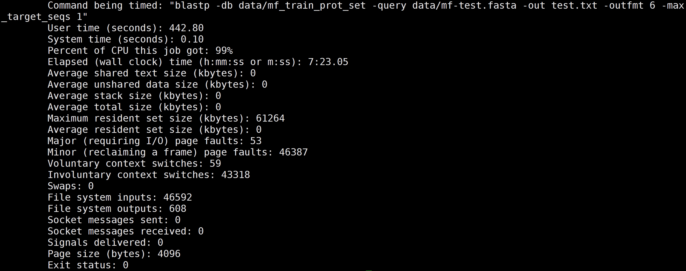

The execution time is measured with `Elapsed (wall clock) time (h:mm:ss or m:ss)`, and the memory consumption is measured with `Maximum resident set size (kbytes)`.
